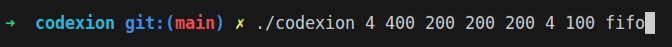
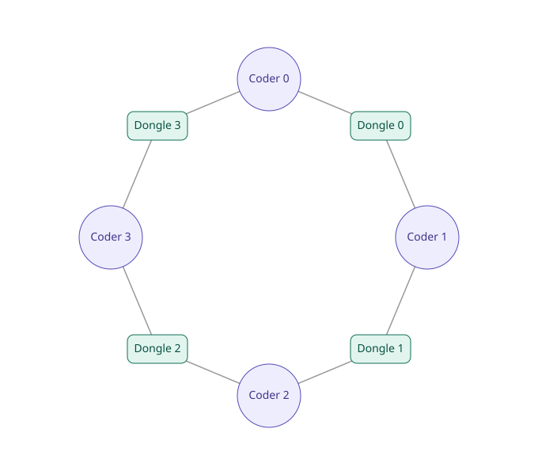
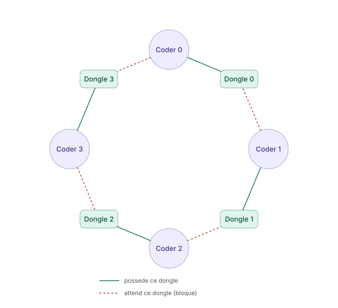
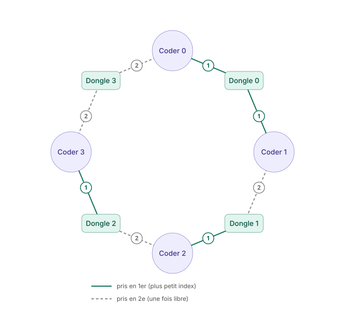
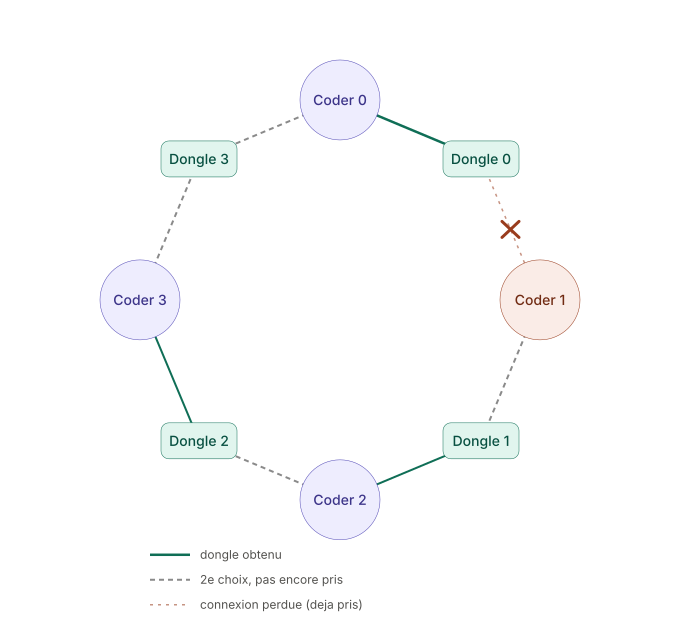
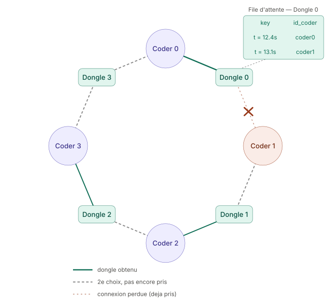
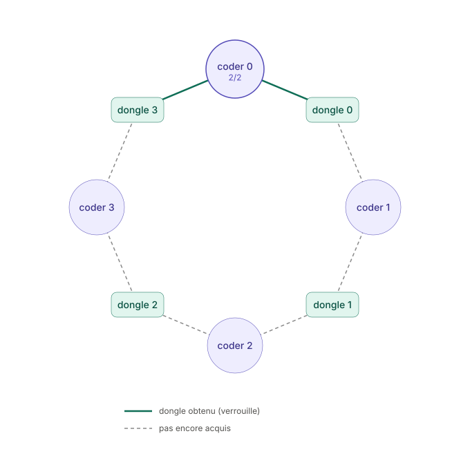
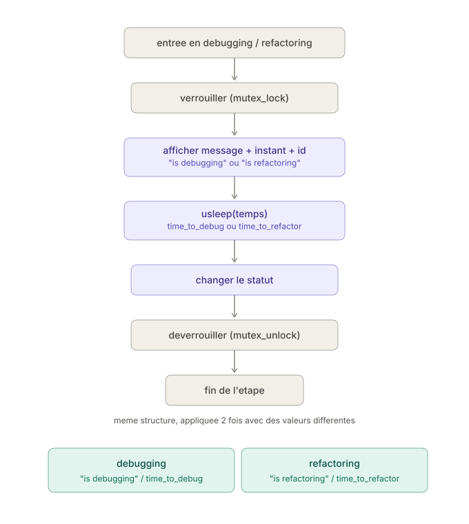

 ## Description
 
Codexion est un projet qui a pour but de faire comprendre le fonctionnement du multi-threading.
 
Le programme prend en argument, via le terminal :
- le nombre de coders
- le délai avant burnout
- le temps de compilation
- le temps de debug
- le temps de refacto
- le nombre de compilations requises
- le temps de repos pour les dongles
- le planificateur



L'objectif est de simuler simultanément plusieurs unités de traitement 
(les coders) a:
- Acquerir 2 dongle necessaire pour l'execution
- Compiler
- Debbuger
- Refactoriser

 sans provoquer ni crash, ni erreur d'affichage. Mais pour s'exécuter, 
 chaque thread a besoin de s'emparer de 2 dongles.
 
**Thread** : un fil d'exécution — une unité de traitement qui s'exécute 
en parallèle (ou en concurrence) avec d'autres, à l'intérieur d'un même 
programme.
Plusieurs threads partagent la même mémoire (variables globales, structures), 
contrairement à des processus séparés. C'est ce qui permet à chaque coder 
d'agir de manière indépendante, comme un "philosophe" dans le problème 
classique des philosophes.
 
**Dongle** : à l'origine, un petit périphérique physique qu'on branche sur un
 port (USB en général) — une clé de licence logicielle, un adaptateur, ou 
 une clé de sécurité.
 Le point commun de tous ces objets : ce sont des ressources physiques uniques, 
 donc un seul programme ou utilisateur peut s'en servir à la fois, 
 sans possibilité de partage simultané.
 Dans ce projet, le dongle représente cette même idée de ressource exclusive et 
 limitée, que chaque coder doit s'approprier temporairement pour pouvoir 
 s'exécuter.

 ## Implémentation technique — les fonctions pthread
- **pthread_mutex_init**: initialise le mutex associé à un dongle, avant que
n'importe quel thread ne puisse l'utiliser.
C'est l'étape de mise en place de la "serrure".
- **pthread_mutex_lock**: permet à un coder de verrouiller un dongle avant de 
l'utiliser. 
Si le dongle est déjà pris, le thread se met en attente jusqu'à ce qu'il 
se libère.
C'est ce qui garantit qu'un seul coder à la fois accède à une ressource 
partagée.
- **pthread_mutex_unlock**: libère le dongle une fois que le coder a terminé de
 l'utiliser, permettant à un autre coder en attente de le récupérer à son tour.
- **pthread_mutex_destroy**: détruit proprement le mutex à la fin du programme, 
une fois qu'il n'est plus utilisé, pour libérer les ressources associées.
- **pthread_create**: crée un nouveau thread — c'est ce qui fait naître chaque 
coder comme une unité d'exécution indépendante.
- **pthread_join**: attend qu'un thread se termine avant de continuer. 
C'est utile pour s'assurer que tous les coders ont fini leur exécution avant
 que le programme principal ne se termine.
- **pthread_cond_init**: initialise la variable de condition (doorbell) associée
 à un dongle, utilisée pour réveiller un coder en attente dès qu'un dongle 
 se libère.
- **pthread_cond_broadcast**: réveille tous les coders en attente sur un même 
dongle, plutôt qu'un seul, utile si plusieurs coders peuvent potentiellement 
se disputer le même dongle libéré.
- **pthread_cond_timedwait**: met un coder en attente d'un dongle, tout en
libérant temporairement le mutex pour ne pas bloquer les autres threads.
Le coder se réveille soit parce qu'un autre coder a signalé la libération du
dongle, soit parce que sa deadline est atteinte (timeout) — ce qui évite qu'ilpthread_cond_broadcast
n'attende indéfiniment et permet de déclencher le burnout si nécessaire.
- **pthread_cond_destroy**: détruit proprement la variable de condition à la fin
 du programme, une fois qu'elle n'est plus utilisée.

Ensemble, ces fonctions garantissent qu'aucun coder ne peut accéder à un dongle
 déjà utilisé par un autre, ce qui empêche les erreurs de concurrence 
 (accès simultané non contrôlé à une même donnée), tout en permettant l'attente
  et la file d'attente décrites dans les étapes précédentes.

 
## Fonctionnement par étape
## PLanificateur
Un planifiacateur est un composant qui determine a chaque instant qu'elle
codeur aura le droit de prendre les dongles pour s'executer.
2 type de strategy peux etre choisi via FIFO ou EDF.

- FIFO(First In, First Out): est la strategy le plus simple "premier 
		arriver, premier servi".Cela signifie que le premier coder qui
		obtiendra ses dongle pourra s'executer
- EDF(Earliest Deadline First): permet de selectionner en priorité le codeur
		dont le temps restant est le  plus proche de leur deadline.
## Aquering_dongles
### Étape 1 — Le problème
 
Imaginons que nous avons 4 coders (threads), chacun placé entre 2 dongles :
 

 
Pour qu'un coder puisse s'exécuter, il doit s'emparer de ses deux dongles :
celui de gauche et celui de droite.
Le problème apparaît si tous les coders essaient de prendre leur premier dongle
 exactement au même moment : chacun réussit à en bloquer un, mais aucun ne 
 parvient à obtenir le second, car celui-ci est déjà détenu par son voisin.
 
Résultat : tous les coders restent bloqués indéfiniment, chacun en attente 
d'un dongle qui ne se libérera jamais.
C'est un **interblocage** (deadlock) — pas un crash à proprement parler, 
puisque le programme ne plante pas, mais il reste figé pour toujours.
 

 
### Étape 2 — Solution
Pour éviter ce phénomène, chaque coder trie en ordre croissant parmi les deux
dongles qu'ils possèdent et essaient de recuperer le plus petit.

#### Exemple :
```bash
coder[0] -> dongle[0] < dongle[3]
coder[0] prend dongle[0]
 
coder[1] -> dongle[0] < dongle[1]
coder[1] prend dongle[0]
 
coder[2] -> dongle[1] < dongle[2]
coder[2] prend dongle[1]
 
coder[3] -> dongle[2] < dongle[3]
coder[3] prend dongle[2]
```
 


Conséquence : deux coders voisins (par exemple coder[0] et coder[1]) vont 
viser le même dongle en premier et donc se le disputer.
Un seul des deux l'obtiendra, l'autre patientera le temps qu'il se libère 
— mais sans jamais créer de cycle d'attente circulaire, puisque tous les
coders convergent dans le même ordre vers les index les plus bas.

### Étape 3 _ Resolution de la concurrence
Chaque dongle possède un tableau de priorité, qui associe à chaque coder 
l'entourant son identifiant et une clé.
Cette clé représente une valeur différente selon la strategie choisie :

FIFO : la clé représente l'instant d'arrivée du coder.
EDF : la clé représente l'instant de sa deadline.

Lorsque deux coders se disputent le même dongle, celui dont la clé a la plus
petite valeur devient prioritaire et récupère le dongle. 
Ce mécanisme permet ainsi de sélectionner automatiquement le coder à servir
 en premier.

### Étape 4 — Acquisition d'un dongle en détail

Avant de manipuler le dongle, le coder appelle la fonction 
`pthread_mutex_lock()` afin de le verrouiller et d'être le seul à accéder à 
son état (`accessible`, `last_release`, et son tableau de priorité), pour :

- Vérifier que le nombre de coders ne dépasse pas le nombre maximum autorisé 
dans le tableau
- S'enregistrer, et remonter en tête du tableau si sa clé est la plus petite

Puis valider ces 4 conditions :

- Le dongle est bien accessible
- Le temps de repos du dongle est écoulé
- Le coder est bien en tête du tableau de priorité
- Il n'y a pas de burnout

Si toutes les conditions ne sont pas validées, la fonction 
`pthread_cond_timedwait()` permet de mettre le coder en veille, et 
le réveillera de 2 manières différentes :

1. **Par timeout** : réveiller le coder toutes les 50ms pour revérifier 
les conditions
2. **Par broadcast** : réveiller le coder dès que le dongle se libère

Il pourra alors revérifier si les conditions ci-dessus sont valides.

Sinon (si les conditions sont valides), le dongle est attribué au coder en tête
de liste, le tableau de priorité est mis à jour (retrait de la liste d'attente, actualisation de `last_release`, etc.), puis le dongle est déverrouillé avec 
la fonction `pthread_mutex_unlock()`

bloquer l'accessibiliter du dongle.
Cette etape sera effectuer 2 fois.
Puis faire passer l'etat de acquiring_dongle a compiling


## Compiling

Le compiling consiste à :

- Afficher le message "is compiling" et l'instant
- Enregistrer l'instant de début de compilation (utilisé pour le burnout et l'EDF)
- Simuler la durée de la compilation via usleep()
- Pour chaque dongle (gauche puis droite) : débloquer son accessibilité, enregistrer l'instant de relâchement, puis réveiller les coders en attente sur ce dongle via pthread_cond_broadcast()
- Incrémenter le nombre de compilations effectuées par le coder
- Faire passer l'état de compiling à debugging

tout en protégeant chaque étape qui touche une donnée partagée par le mutex correspondant (coder ou dongle).


## Debugging et refactoring

Debugging et refactoring font exactement la meme chose:
- Afficher le message "is debugging" ou "is refactoring", l'instant, l'identifiant du coder
- Simuler la durée simulée est time_to_debug / time_to_refactor usleep()
- changement de status
tous securisant pthread_mutex_unlock/pthread_mutex_unlock


## Burnout

Le burnout est surveillé par un thread dédié (monitor_thread), lancé en parallèle des threads coders, dont le rôle est de vérifier en continu qu'aucun coder ne reste trop longtemps sans avoir recompilé.
Condition d'arrêt

Le thread tourne tant que le nombre total de compilations effectuées par tous les coders n'a pas atteint la cible (nombre_de_coders * nombre_de_compiles_required). Ce total est recalculé à chaque tour de boucle en sommant le number_of_compiles de chaque coder — la surveillance s'arrête donc naturellement une fois que tout le monde a atteint son quota, sans qu'aucun burnout ne se soit produit.
Détection

À chaque tour, pour chaque coder, le thread calcule le temps écoulé depuis le début de sa dernière compilation (maintenant - last_compile_start). Si ce temps dépasse le délai autorisé (time_to_burnout), cela signifie que le coder est resté trop longtemps sans recompiler (par exemple bloqué en attente de ses dongles) : il "burnout".

Conséquences du burnout

Dès qu'un burnout est détecté :
- le statut du coder passe à BURNOUT
- un message est loggé ("burned out")
- le flag global hall->burnout passe à 1
- le thread de surveillance s'arrête immédiatement

Ce flag est ensuite lu par tous les autres threads en attente : chaque coder arrête sa boucle principale, et tout coder en attente d'un dongle arrête d'attendre. Un seul burnout suffit donc à stopper proprement toute la simulation, sans laisser de thread tourner indéfiniment.

Fréquence et protection

La vérification se fait toutes les 5ms (usleep(5000)). Chaque lecture des données d'un coder est protégée par son propre mutex, et l'écriture du flag global de burnout est protégée par un mutex dédié — deux verrous distincts pour deux données distinctes.
