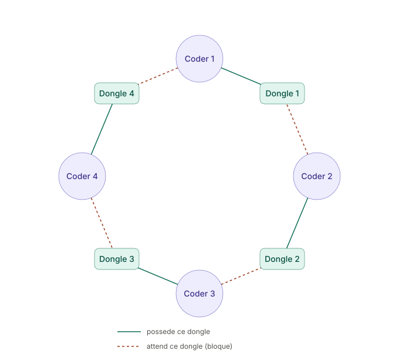
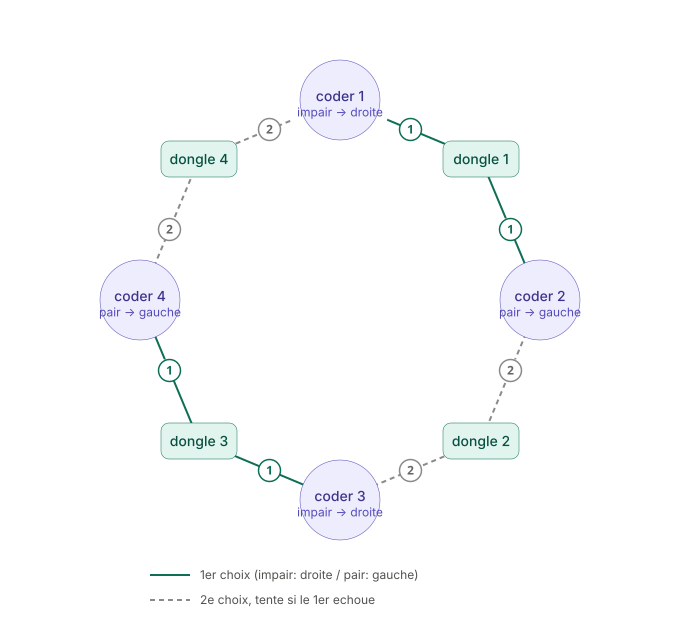
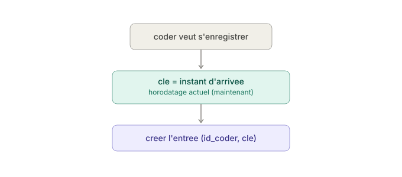
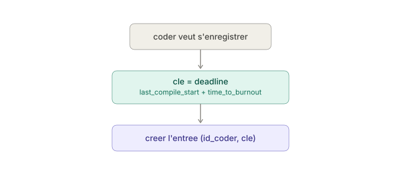
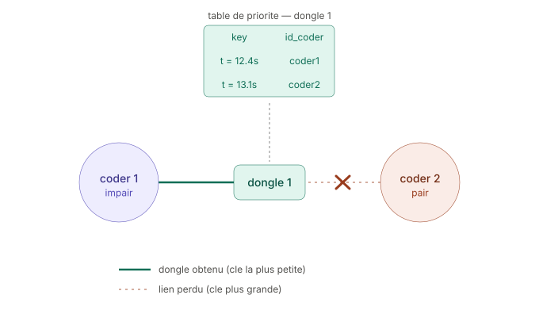
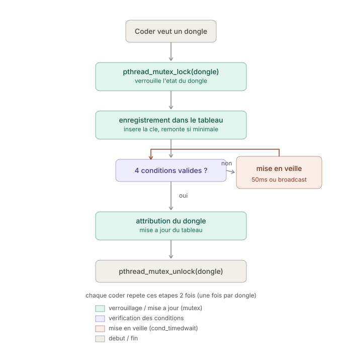
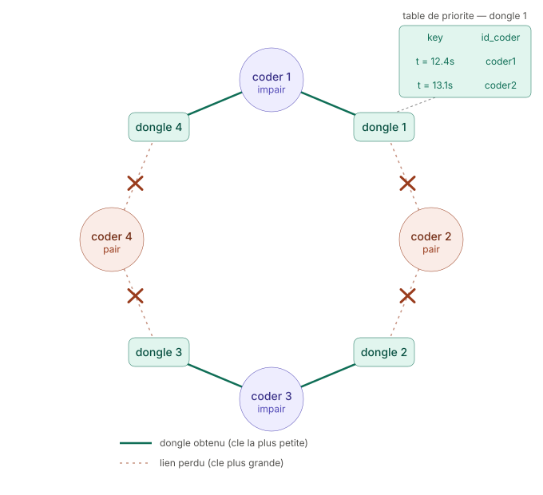

*This project has been created as part of the 42 curriculum by cehenrot.*

# Codexion

## Description

Codexion is a project designed to build an understanding of how multi-threading works.

The program takes the following arguments via the terminal:
- the number of coders
- the delay before burnout
- the compilation time
- the debug time
- the refactor time
- the number of compiles required
- the dongle cooldown time
- the scheduler


The goal is to simulate several processing units (the coders) running concurrently, each of which must:
- Acquire the 2 dongles needed to run
- Compile
- Debug
- Refactor

without causing any crash or display error. To run, however, each thread needs to acquire 2 dongles.

**Thread**: a thread of execution — a unit of processing that runs in parallel (or concurrently) with others, inside the same program.
Multiple threads share the same memory (global variables, structures), unlike separate processes. This is what lets each coder act independently, like a "philosopher" in the classic dining philosophers problem.

**Dongle**: originally, a small physical device plugged into a port (usually USB) — a software license key, an adapter, or a security key.
What all these objects have in common: they are unique physical resources, so only one program or user can use them at a time, with no possibility of simultaneous sharing.
In this project, the dongle represents that same idea of an exclusive, limited resource that each coder must temporarily claim in order to run.

## Instructions

### Compilation
```bash
make
```
Builds the `codexion` executable with the flags `-Wall -Wextra -Werror -pthread`.

Other available rules:
- `make clean`: removes the object files (`.o`)
- `make fclean`: also removes the executable
- `make re`: rebuilds the whole project from scratch

### Execution
```bash
./codexion number_of_coders time_to_burnout time_to_compile time_to_debug time_to_refactor number_of_compiles_required dongle_cooldown scheduler
```

| Argument | Description |
|---|---|
| `number_of_coders` | Number of coders |
| `time_to_burnout` | Delay before burnout (ms) |
| `time_to_compile` | Compilation time (ms) |
| `time_to_debug` | Debug time (ms) |
| `time_to_refactor` | Refactor time (ms) |
| `number_of_compiles_required` | Number of compiles required per coder |
| `dongle_cooldown` | Rest time for a dongle after release (ms) |
| `scheduler` | Scheduling strategy: `fifo` or `edf` |

Example:
```bash
./codexion 5 800 200 100 100 5 50 fifo
```

## Execution output
On every event, the program prints a line containing:

- **The elapsed time** (in milliseconds) since the program started, up to the moment of this print.
This is a relative time, not an absolute clock time, so that each coder's progress can be easily compared.
- **The identifier** of the coder involved in the event (their number, e.g. 0, 1, 2...).
- **The coder's state** at the time of the print, among the following values:
	- `is compiling` -> The coder has just obtained their 2 dongles and starts compiling.
	- `is debugging` -> The coder moves to the debug phase.
	- `is refactoring` -> The coder moves to the refactor phase.
	- `burned out` -> The coder exceeded their allowed delay without recompiling in time.

## Technical implementation — pthread functions
**pthread_mutex_init**: initializes the mutex tied to a dongle, before any thread can use it. This is the step where the "lock" is set up.
- **pthread_mutex_lock**: lets a coder lock a dongle before using it. If the dongle is already taken, the thread waits until it is released. This guarantees that only one coder at a time accesses a shared resource.
- **pthread_mutex_unlock**: releases the dongle once the coder is done using it, letting another waiting coder claim it in turn.
- **pthread_mutex_destroy**: properly destroys the mutex at the end of the program, once it is no longer used, to free the associated resources.
- **pthread_create**: creates a new thread — this is what brings each coder to life as an independent unit of execution.
- **pthread_join**: waits for a thread to finish before continuing. This is used to make sure all coders have finished before the main program ends.
- **pthread_cond_init**: initializes the condition variable (doorbell) tied to a dongle, used to wake up a waiting coder as soon as a dongle is released.
- **pthread_cond_broadcast**: wakes up all coders waiting on the same dongle, rather than just one, which is useful since several coders may potentially compete for the same freed dongle.
- **pthread_cond_timedwait**: puts a coder to sleep while waiting for a dongle, temporarily releasing the mutex so as not to block other threads. The coder wakes up either because another coder signaled that the dongle was released, or because its deadline was reached (timeout) — which prevents it from waiting indefinitely and allows burnout to be triggered if necessary.
- **pthread_cond_destroy**: properly destroys the condition variable at the end of the program, once it is no longer used.

Together, these functions guarantee that no coder can access a dongle already in use by another, which prevents concurrency errors (uncontrolled simultaneous access to the same data), while still allowing the waiting and queueing described in the previous steps.

## Step-by-step operation
### Scheduler
A scheduler is a component that determines, at every instant, which coder is allowed to take the dongles in order to run.
Two types of strategy can be chosen: FIFO or EDF.

- FIFO (First In, First Out): the simplest strategy — "first come, first served." This means the first coder to obtain their dongles gets to run.
- EDF (Earliest Deadline First): gives priority to the coder whose remaining time before their deadline is the shortest.

### Acquiring dongles
#### Step 1 — The problem

Let's imagine we have 4 coders (threads), each placed between 2 dongles:


For a coder to run, it must claim both of its dongles: the left one and the right one.
The problem appears if all coders try to take their first dongle at exactly the same time: each one manages to lock one, but none manages to get the second, since it is already held by its neighbor.

Result: all coders stay blocked indefinitely, each waiting for a dongle that will never be released.
This is a **deadlock** — not a crash as such, since the program doesn't stop running, but it stays frozen forever.



#### Step 2 — Solution
To avoid this, every odd-numbered coder starts by trying to take the right-hand dongle, while even-numbered ones take the left-hand one.

#### Example:
```bash
Round 0:
coder[1] -> odd
coder[1] takes the right dongle

coder[2] -> even
coder[2] takes the left dongle

coder[3] -> odd
coder[3] takes the right dongle

coder[4] -> even
coder[4] takes the left dongle
```

Consequence: every coder whose id is an odd number starts trying to take its right dongle, and even ones take the left dongle. This solution breaks the cycle while also letting several coders run at the same time, since dongle acquisition is optimized.

Result: each coder ends up competing with its neighbor for the dongle.


#### Step 3 — Resolving contention
The scheduler settles this contention using a strategy:
	- FIFO: the key represents the coder's arrival time.
	or
	- EDF: the key represents the coder's deadline.

Explanation:
Each dongle has a priority table that associates each of the coders around it with its id and a key.
This key represents a different value depending on the chosen strategy:
- For FIFO, the key represents the moment the coder registered in the priority table.
This means that if an odd-numbered coder registered first, its key will be smaller than its neighbor's, and it will have priority.



- For EDF, the key is computed from the time remaining before the coder reaches burnout — in other words, the coder closest to the end has priority.





#### Step 4 — Acquiring a dongle in detail

Before touching the dongle, the coder calls `pthread_mutex_lock()` to lock it and be the only one accessing its state (`accessible`, `last_release`, and its priority table), in order to:

- Check that the number of coders doesn't exceed the maximum allowed in the table
- Register itself, and move to the front of the table if its key is the smallest

Then check these 4 conditions:

- The dongle is accessible
- The dongle's rest (cooldown) time has elapsed
- The coder is at the front of the priority table
- No burnout has occurred

If any of these conditions is not met, `pthread_cond_timedwait()` puts the coder to sleep, and it will be woken up in 2 different ways:

1. **By timeout**: the coder is woken up every 50ms to recheck the conditions
2. **By broadcast**: the coder is woken up as soon as the dongle is released

It then rechecks whether the conditions above are met.

Otherwise (if the conditions are met), the dongle is assigned to the coder at the front of the list, the priority table is updated (removal from the waiting list, `last_release` refreshed, etc.), and the dongle is unlocked with `pthread_mutex_unlock()`.

This step is carried out twice, once per dongle.
The coder's state then moves from acquiring_dongle to compiling.


## Compiling

Compiling consists of:

- Printing the "is compiling" message with the timestamp
- Recording the compile start time (used for burnout and EDF)
- Simulating the compile duration with usleep()
- For each dongle (left then right): marking it as no longer accessible, recording the release time, then waking up the coders waiting on that dongle via pthread_cond_broadcast()
- Incrementing the coder's completed compile count
- Moving the state from compiling to debugging

All of this while protecting every step that touches shared data with the corresponding mutex (coder or dongle).


## Debugging and refactoring

Debugging and refactoring do exactly the same thing:
- Print the "is debugging" or "is refactoring" message, the timestamp, and the coder's id.
- Simulate the duration with usleep() (time_to_debug / time_to_refactor)
- Change the state

All of this secured with pthread_mutex_lock/pthread_mutex_unlock.


## Burnout

Burnout is monitored by a dedicated thread (monitor_thread), started alongside the coder threads, whose job is to continuously check that no coder goes too long without recompiling.

### Monitor logic

**Stop condition**:
The thread keeps running as long as the total number of compiles completed by all coders hasn't reached the target (number_of_coders * number_of_compiles_required).
This total is recalculated on every loop iteration by summing each coder's number_of_compiles — so monitoring stops naturally once everyone has reached their quota, without any burnout having occurred.

**Detection**:
On every iteration, for each coder, the thread computes the time elapsed since the start of their last compile (now - last_compile_start).
If this exceeds the allowed delay (time_to_burnout), it means the coder went too long without recompiling (e.g. stuck waiting for their dongles): they "burn out".

**Consequences of burnout**:
As soon as a burnout is detected:
- the coder's status becomes BURNOUT
- a message is logged ("burned out")
- the global hall->burnout flag is set to 1
- the monitor thread stops immediately

This flag is then read by all other waiting threads: every coder stops its main loop, and any coder waiting for a dongle stops waiting.
A single burnout is therefore enough to cleanly stop the whole simulation, without leaving any thread running indefinitely.

**Frequency and protection**:
The check runs every 5ms (usleep(5000)). Each read of a coder's data is protected by its own mutex, and writing to the global burnout flag is protected by a dedicated mutex — two separate locks for two separate pieces of data.


## Blocking cases handled

- **Deadlock prevention (Coffman's conditions)** — Classic deadlock happens when all coders grab their first dongle at the same time and wait forever for the second (circular wait). This is prevented by breaking the *circular wait* condition: odd-numbered coders always try their right dongle first, even-numbered coders always try their left dongle first. This asymmetric acquisition order removes the cycle, since two neighbors can never both be waiting on each other in the same direction.
- **Starvation prevention** — Each dongle keeps a priority table of the coders around it. A coder can only take the dongle once it is at the front of that table (smallest key: earliest arrival for FIFO, closest deadline for EDF). Because the key strictly orders who goes next, no coder can be repeatedly skipped by later arrivals — it only has to wait for coders that were already ahead of it.
- **Cooldown handling** — After releasing a dongle, its `last_release` timestamp is recorded under the dongle's mutex. A coder trying to reacquire it must wait until `dongle_cooldown` ms have passed since that timestamp; this condition is checked together with the other acquisition conditions in `pthread_cond_timedwait`'s wake-up loop.
- **Precise burnout detection** — A dedicated monitor thread checks every coder every 5ms, comparing `now - last_compile_start` to `time_to_burnout`. Each coder's data is read under its own mutex, keeping detection both frequent and race-free.
- **Log serialization** — All log output goes through a single function guarded by a dedicated log mutex, so one coder's full log line is always written atomically before another can start. The data being logged (coder/dongle state) is read separately under its own mutex before the log call.

## Thread synchronization mechanisms

This project relies on three POSIX primitives: `pthread_mutex_t` for mutual exclusion, `pthread_cond_t` for wait/wake-up signaling, and `pthread_create`/`pthread_join` to manage the coder and monitor threads. Each shared resource — dongles, the log output, and the monitor's burnout flag — is protected by its own dedicated mutex, so a lock held for one resource never blocks access to another.

**Dongles** — Each dongle has its own `pthread_mutex_t` protecting its state (`accessible`, `last_release`, priority table) and its own `pthread_cond_t` used as a "doorbell". A coder locks the mutex, checks all four acquisition conditions (accessible, cooldown elapsed, at the front of the priority table, no burnout) and either claims the dongle immediately or calls `pthread_cond_timedwait()` to sleep until woken by a `pthread_cond_broadcast()` (fired when the dongle is released) or by its own 50ms timeout. Locking the mutex around the whole check-and-claim sequence is what prevents the race condition where two coders could both see the dongle as "accessible" and both claim it: only the coder holding the mutex can read and update the state, so the check and the claim happen as a single atomic step.

**Logging** — A dedicated log mutex is locked around the entire print call, so two threads logging at the same moment can never interleave their output into a single garbled line. The coder/dongle data being printed is read beforehand under its own mutex; the log mutex only serializes the write itself.

**Monitor state** — The global burnout flag is protected by its own mutex, separate from every coder's mutex and every dongle's mutex. The monitor thread writes to it once, under this mutex, the instant it detects a burnout; every coder and the monitor itself read it the same way before deciding whether to keep waiting or looping. This is the thread-safe channel through which the monitor communicates a burnout to every coder thread: as soon as the flag is set, any coder currently blocked in `pthread_cond_timedwait()` re-checks it on its next wake-up (broadcast or timeout) and exits its wait loop instead of claiming a dongle.

## Resources

Most of the research and technical understanding behind this project (mutexes, condition variables, FIFO/EDF scheduling, deadlock handling...) was built with the help of AI, along with discussions with other students at school for overall understanding of the subject and testing.
